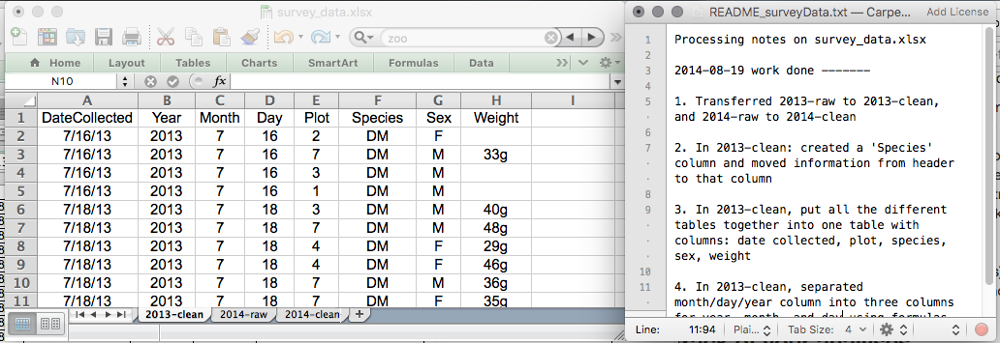

The most common mistake made is treating spreadsheet programs like lab notebooks, that is,
relying on context, notes in the margin,
spatial layout of data and fields to convey information. As humans, we
can (usually) interpret these things, but computers don't view information the same way, and
unless we explain to the computer what every single thing means (and
that can be hard!), it will not be able to see how our data fits
together.

Using the power of computers, we can manage and analyze data in much more 
effective and faster ways, but to use that power, we have to set up
our data for the computer to be able to understand it (and computers are very 
literal).

This is why it’s extremely important to set up well-formatted
tables from the outset - before you even start entering data from
your very first preliminary experiment. Data organization is the
foundation of your research project. It can make it easier or harder
to work with your data throughout your analysis, so it's worth
thinking about when you're doing your data entry or setting up your
experiment. You can set things up in different ways in spreadsheets,
but some of these choices can limit your ability to work with the data in other programs or
have the you-of-6-months-from-now or your collaborator work with the
data.

> Note: the best layouts/formats (as well as software and
> interfaces) for data entry and data analysis might be
> different. It is important to take this into account, and ideally
> automate the conversion from one to another.

### Keeping track of your analyses

When you're working with spreadsheets, during data clean up or analyses, it's
very easy to end up with a spreadsheet that looks very different from the one
you started with. In order to be able to reproduce your analyses or figure out
what you did when Reviewer #3 asks for a different analysis, you should

- create a new file with your cleaned or analyzed data. Don't modify
the original dataset, or you will never know where you started!
- keep track of the steps you took in your clean up or analysis. You should track 
these steps as you would any step in an experiment. We recommend that you 
do this in a plain text file stored in the same folder as the data file. 

This might be an example of a spreadsheet setup:

Put these principles in to practice today during your Exercises.

>Note: This is out of scope for this lesson, but for information on how to maintain version control over your data, look at our lesson on ['Git'](http://swcarpentry.github.io/git-novice/).

### Structuring data in spreadsheets

The cardinal rule of using spreadsheet programs for data is to keep it "tidy":

1. Put all your variables in columns - the thing you're measuring,
   like 'weight' or 'temperature'.
2. Put each observation in its own row.
3. Don't combine multiple pieces of information in one
   cell. Sometimes it just seems like one thing, but think if that's
   the only way you'll want to be able to use or sort that data.
4. Leave the raw data raw - don't change it!
5. Export the cleaned data to a text-based format like CSV (comma-separated values) format. This
   ensures that anyone can use the data, and is required by
   most data repositories.

For instance, we have data from a survey of small mammals in a desert
ecosystem. Different people have gone to the field and entered data into a spreadsheet. They keep track of things like species, plot,
weight, sex and date collected.

If they were to keep track of the data like this:

the problem is that species and sex are in the same field. So, if they wanted to 
look at all of one species or look at different weight distributions by sex, 
it would be hard to do this using this data setup. If instead we put sex and species 
in different columns, you can see that it would be much easier. 

### Columns for variables and rows for observations

The rule of thumb, when setting up a datasheet, is columns =
variables, rows = observations, cells = data (values).

So, instead we should have:

> ## Discussion
> If not already discussed, introduce the dataset that will be used in this
> lesson, and in the other ecology lessons, the [Portal Project Teaching Dataset](http://www.datacarpentry.org/ecology-workshop/data/). 
>
> The data used in the ecology lessons are observations of a small mammal community in southern Arizona. This is part of a project studying the effects of rodents and ants on the plant community that has been running for almost 40 years. The rodents are sampled on a series of 24 plots, with different experimental manipulations controlling which rodents are allowed to access which plots.
> 
> This is a real dataset that has been used in over 100 publications. We’ve simplified it just a little bit for the workshop, but you can download the full dataset and work with it using exactly the same tools we’ll learn about today.  
{: .discussion}

> ## Exercise
> 
> We're going to take a messy version of the survey data and describe how we would clean it up.
>
> 1. Download the data by clicking [here](https://ndownloader.figshare.com/files/2252083) to get it from FigShare.
> 2. Open up the data in a spreadsheet program. 
> 3. You can see that there are two tabs. Two field assistants conducted the surveys, one
in 2013 and one in 2014, and they both kept track of the data in their own way in tabs `2013` and `2014` of the dataset, 
>respectively. Now
you're the person in charge of this project and you want to be able to 
start analyzing the data.   
> 4. With the person next to you, identify what is wrong with this spreadsheet. Also discuss the steps you would need to take to clean up the `2013` and `2014` tabs, and to put them all together in one spreadsheet. 
>
> **Important** Do not forget our first piece of advice: to
> create a new file (or tab) for the cleaned data, never
> modify your original (raw) data.
> 
> After you go through this exercise, we'll discuss as a group what was wrong
> with this data and how you would fix it. 
> 
> > ## Solution
> > - Take about 10 minutes to work on this exercise.
> > - All the mistakes in [02-common-mistakes](../02-common-mistakes) are present in the messy dataset. If the
> > exercise is done during a workshop, ask people what they saw as wrong with
> > the data. As they bring up different points, you can refer to [02-common-mistakes](../02-common-mistakes)
> > or expand a bit on the point they brought up.  
> > - Note that there is a problem with dates in table 'plot 3' in `2014` tab. The field assistant who collected the data
> > for year 2014 initially forgot to include their data for 'plot 3'. They came back in 2015 to include the missing data and 
> > entered the dates for 'plot 3' in the dataset without the year. Excel automatically filled in the missing year as the
> > current year (i.e. 2015) - introducing an error in the data without the field assistant realising. If you get a response 
> > from the participants that they've spotted and fixed the problem with date, you can say you'll come back to dates again 
> > towards the end of lesson in episode [03-dates-as-data](../03-dates-as-data). If participants have not spotted the 
> > problem with dates in 'plot 3' table, that's fine as you will address peculiarities of working with dates in 
> > spreadsheets in episode [03-dates-as-data](../03-dates-as-data).  
> {: .solution}
{: .challenge}

An excellent reference, in particular with regard to R scripting is

> Hadley Wickham, *Tidy Data*, Vol. 59, Issue 10, Sep 2014, Journal of
> Statistical Software. [http://www.jstatsoft.org/v59/i10](http://www.jstatsoft.org/v59/i10).

