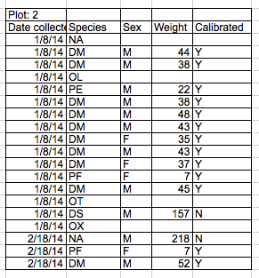

Authors:**Christie Bahlai**, **Aleksandra Pawlik** 
Contributors: **Jennifer Bryan**, **Alexander Duryee**, **Jeffrey Hollister**, **Daisie Huang**, **Owen Jones**, and **Ben Marwick**

## Common Spreadsheet Errors

- [Multiple tables](#tables)
- [Multiple tabs](#tabs)
- [Not filling in zeros](#zeros)
- [Using bad null values](#null)
- [Using formatting to convey information](#formatting)
- [Using formatting to make the data sheet look pretty](#formatting_pretty)
- [Placing comments or units in cells](#units)
- [More than one piece of information in a cell](#info)
- [Field name problems](#field_name)
- [Special characters in data](#special)
- [Inclusion of metadata in data table](#metadata)
- [Date formatting](../03-dates-as-data/)

##  Multiple tables

A common strategy is creating multiple data tables within
one spreadsheet. This confuses the computer, so don't do this!
When you create multiple tables within one
spreadsheet, you’re drawing false associations between things for the computer,
which sees each row as an observation. You’re also potentially using the same
field name in multiple places, which will make it harder to clean your data up
into a usable form. The example below depicts the problem:

##  Multiple tabs

But what about workbook tabs? That seems like an easy way to organize data, right? Well, yes and no. When you create extra tabs, you fail
to allow the computer to see connections in the data that are there (you have to introduce spreadsheet application-specific functions or
scripting to ensure this connection). Say, for instance, you make a separate tab for each day you take a measurement.

This isn't good practice for two reasons:
1) you are more likely to accidentally add inconsistencies to your data if each time you take a measurement, you start recording data in a new tab, and
2) even if you manage to prevent all inconsistencies from creeping in, you will add an extra step for yourself before you analyze the
data because you will have to combine these data into a single datatable. You will have to explicitly tell the computer how to combine
tabs - and if the tabs are inconsistently formatted, you might even have to do it manually.

The next time you’re entering data, and you go to create another tab or table,
ask yourself if you could avoid adding this tab by adding another column to your original spreadsheet.

Your data sheet might get very long over the course of the experiment. This makes it harder to enter data if you can’t see your headers
at the top of the spreadsheet. But don't repeat your header row. These can easily get mixed into the data, 
leading to problems down the road.

Instead you can freeze the column headers so that they remain visible even when you have a spreadsheet with many rows.

[Documentation on how to freeze column headers](https://support.office.com/en-ca/article/Freeze-column-headings-for-easy-scrolling-57ccce0c-cf85-4725-9579-c5d13106ca6a)

##  Not filling in zeros

It might be that when you're measuring something, it's
usually a zero, say the number of times a rabbit
is observed in the survey. Why bother
writing in the number zero in that column, when it's mostly zeros?

However, there's a difference between a zero and a blank cell in a spreadsheet. To the computer, a zero is actually data. You measured
or counted it. A blank cell means that it wasn't measured and the computer will interpret it as a null value.

The spreadsheets or statistical programs will likely mis-interpret blank cells that are meant to be zero. This is equivalent to leaving
out data. Zero observations are real data. Leaving zero data blank is not good in a written lab notebook, but is more problematic when
you move your data into a digital format like a spreadsheet.

##  Using bad null values
**Example**: using -999 or other numerical values (or zero).

**Solution**: Many statistical programs will not recognize that numeric values of null are indeed null. It will depend on the final
application of your data and how you intend to analyse it, but it is essential to use a clearly defined and consistent null indicator.
Blanks (most applications) and NA (for R) are good choices.

From White et al, 2013, [Nine simple ways to make it easier to (re)use your data.](http://library.queensu.ca/ojs/index.php/IEE/article/view/4608/4898) Ideas in Ecology and Evolution:

##  Using formatting to convey information 

**Example**: highlighting cells, rows or columns that should be excluded from an analysis, leaving blank rows to indicate separations in data.

**Solution**: create a new field to encode which data should be excluded.

##  Using formatting to make the data sheet look pretty

**Example**: merging cells.

**Solution**: If you’re not careful, formatting a worksheet to be more aesthetically pleasing can compromise your computer’s ability to
see associations in the data. Merged cells will make your data unreadable by statistics software. Consider restructuring your data in
such a way that you will not need to merge cells to organize your data.

##  Placing comments or units in cells

**Example**: Your data was collected, in part, by a summer student who you later found out was mis-identifying some of your species, some
of the time. You want a way to note these data are suspect.

**Solution**: Most analysis software can't see Excel or LibreOffice comments, and would be confused by comments placed within your data
cells. As described above for formatting, create another field if you need to add notes to cells. Similarly, don’t include units in
cells: ideally, all the measurements you place in one column should be in the same unit, but if for some reason they aren’t, create
another field and specify the units the cell is in.

##  More than one piece of information in a cell

**Example**: You find one male, and one female of the same species. You enter this as 1M, 1F.

**Solution**: Don't include more than one piece of information in a cell. This will limit the ways in which you can analyze your data. 
If you need both these measurements, design your data sheet to include this information. For example, include one column for number of
individuals and a separate column for sex.

##  Field name problems
Choose descriptive field names, but be careful not to include spaces, numbers, or special characters of any kind. Spaces can be
misinterpreted by parsers that use whitespace as delimiters and some programs don’t like field names that are text strings that start
with numbers.  

Underscores (`_`) are a good alternative to spaces. Consider writing names in camel case (like this: ExampleFileName) to improve
readability. Remember that abbreviations that make sense at the moment may not be so obvious in 6 months, but don't overdo it with names
that are excessively long. Including the units in the field names avoids confusion and enables others to readily interpret your fields.

**Examples**  

<table align = "left" style = "width =50%; border: 1px solid black;">
<tr>
	<td> <b>Good Name</b></td>  
	<td> <b>Good Alternative </b> </td> 
	<td> <b>Avoid </b></td> 
</tr>
<tr>
	<td> Max_temp_C</td>
	<td> MaxTemp </td>
	<td> Maximum Temp (°C) </td>
</tr>
<tr>
	<td> Precipitation_mm</td>
	<td> Precipitation</td>
	<td> precmm </td>
</tr>	
<tr>
	<td> Mean_year_growth</td>
	<td> MeanYearGrowth </td>
	<td> Mean growth/year</td>	
</tr>	
<tr>
	<td> sex </td>
	<td> sex </td>	
	<td> M/F </td>
</tr>
<tr>	
	<td> weight </td>
	<td> weight </td>	
	<td> w.</td>	
</tr>
<tr>	
	<td> cell_type </td>
	<td> CellType </td>
	<td> Cell Type </td>
</tr>
<tr>
	<td> Observation_01 </td>
	<td> first_observation</td>
	<td> 1st Obs</td>
</tr>
</table>

##  Special characters in data

**Example**: You treat your spreadsheet program as a word processor when writing notes, for example copying data directly from Word or
other applications.

**Solution**: This is a common strategy. For example, when writing longer text in a cell, people often include line breaks, em-dashes,
etc in their spreadsheet.  Also, when copying data in from applications such as Word, formatting and fancy non-standard characters (such
as left- and right-aligned quotation marks) are included.  When exporting this data into a coding/statistical environment or into a
relational database, dangerous things may occur, such as lines being cut in half and encoding errors being thrown.

General best practice is to avoid adding characters such as newlines, tabs, and vertical tabs.  In other words, treat a text cell as if
it were a simple web form that can only contain text and spaces.

##  Inclusion of metadata in data table

**Example**: You add a legend at the top or bottom of your data table explaining column meaning, units, exceptions, etc.

**Solution**: While recording data about your data ("metadata") is essential, this information should not be contained in the data file
itself. Unlike a table in a paper or a supplemental file, metadata (in the form of legends) should not be included in a data file since
this information is not data, and including it can disrupt how computer programs interpret your data file. Rather, metadata should be
stored as a separate file in the same directory as your data file, preferably in plain text format with a name that clearly associates
it with your data file. Because metadata files are free text format, they also allow you to encode comments, units, information about
how null values are encoded, etc. that are important to document but can disrupt the formatting of your data file.
