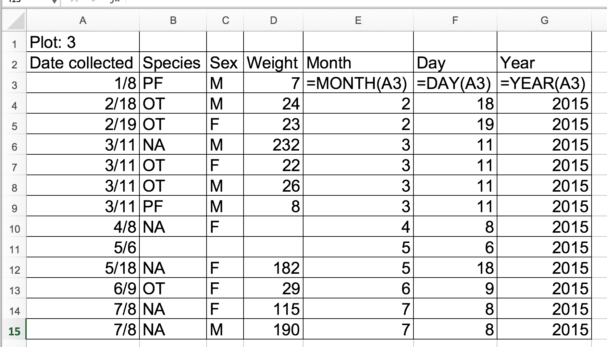

Authors:**Christie Bahlai**, **Aleksandra Pawlik** 
Contributors: **Jennifer Bryan**, **Angel Corpuz**, **Alexander Duryee**,
**Jeffrey Hollister**, **Daisie Huang**, **Owen Jones**, and **Ben Marwick**

## Learning Objectives 

* Describe how dates are stored and formatted in spreadsheets.
* Describe the advantages of alternative date formatting in spreadsheets.
* Demonstrate best practices for entering dates in spreadsheets.

Dates in spreadsheets are stored in one column. Whilst this seems the
most natural way to record dates, it actually is not a good
practice. A spreadsheet application will display the dates in
seemingly correct way (for the human eye) but how it actually handles
and stores the dates may be problematic.

In particular, please remember that functions that are valid for a given
spreadsheet program (be it LibreOffice, Microsoft Excel, OpenOffice.org,
Gnumeric, etc.) are usually guaranteed to be compatible only within the same
famly of products. If you will later need to export the data and need to
conserve the timestamps you are better off handling them using custom solutions.

Let's try with a challenge.

> ## Exercise 
>
> Challenge: pulling month, day and year out of dates 
>
> - In the `dates` tab of your Excel file you have the data from 2014 plot 3. 
> There's a `Date collected` column.
> - Let’s extract month, day and year from the dates to new columns. For this we 
> can use the built in Excel functions
>
> =MONTH(A3)    
> =DAY(A3)  
> =YEAR(A3)
>
> (Make sure the new column is formatted as a number and not as a date.)
>
> You can see that even though you wanted the year to be 2014, Excel
> automatically interpreted it as 2015, the year you entered the data.
>
> > ## Solution
> > 
> {: .solution}
>
{: .challenge}

> ## Exercise
> 
> Challenge: pulling hour, minute and second out of the current time 
>
> Current time and date are best retrieved using the functions `NOW()`, which
> returns the current date and time, and `TODAY()`, which returns the current
> date. The results will be formatted according to your computer's settings.
> 
> - Try to extract the year, month and day from the current date and time string
> returned by the `NOW()` function.
> - Calculate the current time using `NOW()-TODAY()`.
> - Try to extract the hour, minute and second from the current time using
> functions `HOUR()`, `MINUTE()` and `SECOND()`.
> - press `F9` to force the spreadsheet to recalculate the `NOW()` function,
> and check that it has been updated.

{: .challenge}

## Preferred date format

Instead it is much safer to store dates with [MONTH, DAY and YEAR](#day) in separate columns or as [YEAR and DAY-OF-YEAR](#doy) in separate columns.

**Note**: Excel is unable to parse dates from before 1899-12-31, and will thus leave these untouched.  If you’re mixing historic data from before and after this date, Excel will translate only the post-1900 dates into its internal format, thus resulting in mixed data.  If you’re working with historic data, be extremely careful with your dates!
Excel also entertains a second date system, the 1904 date system, as the default in Excel for Macintosh. This system will assign a different serial number than the [1900 date system](https://support.microsoft.com/kb/180162). Because of this, [dates must be checked for accuracy when exporting data from Excel](http://datapub.cdlib.org/2014/04/10/abandon-all-hope-ye-who-enter-dates-in-excel/) (look for dates that are ~4 years off). 

## Data formats in spreadsheets

Spreadsheet programs have numerous “useful features” which allow them to “handle” dates in a variety of ways.

But these ‘features’ often allow ambiguity to creep into your data. Ideally, data should be as unambiguous as possible. 

### Dates stored as integers

The first thing you need to know is that Excel **stores dates as a number** - see the last column in the above figure. Essentially, it counts the days from a default of December 31, 1899, and thus stores July 2, 2014 as  the serial number 41822.

(But wait. That’s the default on my version of Excel. We’ll get into how this can introduce problems down the line later in this lesson. )

This serial number thing can actually be useful in some circumstances. By using
the above functions we can easily add days, months or years to a given date.
Say you had a sampling plan where you needed to sample every thirty seven days.
In another cell, you could type:
    
    =B2+37
    
And it would return

    8-Aug

because it understands the date as a number `41822`, and `41822 + 37 = 41859`
which Excel interprets as August 8, 2014. It retains the format (for the most
part) of the cell that is being operated upon, (unless you did some sort of
formatting to the cell before, and then all bets are off). Month and year
rollovers are internally tracked and applied.

**Note**
Adding years and months and days is slightly trickier because we need to make
sure that we are adding the amount to the correct entity.

- First we extract the single entities (day, month or year)
- We can then add values to to that
- Finally the complete date string is reconstructed using the `DATE()` function.

As for dates, times are handled in a similar way; seconds cam be directly
added but to add hour and minutes we need to make sure that we are adding
the quantities to the correct entities.

Which brings us to the many different ways Excel provides in how it displays dates. If you refer to the figure above, you’ll see that there are many, MANY ways that ambiguity creeps into your data depending on the format you chose when you enter your data, and if you’re not fully cognizant of which format you’re using, you can end up actually entering your data in a way that Excel will badly misinterpret. 

> ## Question  
> What will happen if you save the file in Excel (in `csv` format) and then open the file using a plain text editor? 
{: .callout}

**Note**  
You will notice that when exporting into a text-based format (such as CSV), Excel will export its internal date integer instead of a useful value (that is, the dates will be represented as integer numbers). This can potentially lead to problems, if you use other software to manipulate the file.

### Advantages of Alternative Date Formatting

###  Storing dates as YEAR, MONTH, DAY

Storing dates in YEAR, MONTH, DAY format helps remove this ambiguity. Let's look at this issue a bit closer.

For instance this is a spreadsheet representing insect counts that were taken every few days over the summer, and things went something like this:

If Excel was to be believed, this person had been collecting bugs IN THE FUTURE. Now, we have no doubt this person is highly capable, but I believe time travel was beyond even his grasp.

Entering dates in one cell is helpful but due to the fact that the spreadsheet programmes may interpret and save the data in different ways (doing that somewhat behind the scenes), there is a better practice.  

In dealing with dates in spreadsheets, we recommend separating **date data into separate fields** (day, month, year), which will eliminate any chance of ambiguity. 

###  Storing dates as YEAR, DAY-OF-YEAR

There is also another option:  
You can also store dates as year, and day of year (DOY). Why? Because depending on your
question, this might be what's useful to you, and there is practically no possibility for ambiguity creeping in.

Statistical models often incorporate year as a factor, to account for year-to-year variation, and DOY can be used to measure the passage of time within a year. 

So, can you convert all your dates into DOY format? Well, in Excel, here’s a handy dandy guide:

###  Storing dates as a single string

Another alternative could be to convert the date string
into a single string using the `YYYYMMDDhhmmss` format.
For example the date `March 24, 2015 17:25:35` would
become `20150324172535`, where:

YYYY:   the full year, i.e. 2015  
MM:     the month, i.e. 03  
DD:     the day of month, i.e. 24  
hh:     hour of day, i.e. 17  
mm:     minutes, i.e. 25  
ss:     seconds, i.e. 35  

Such strings will be correctly sorted in ascendng or descending order, and by
knowing the format they can then be correctly processed by the receiving
software.

Previous: [Formatting problems](02-common-mistakes.html)
Next: [Basic quality control and data manipulation in spreadsheets.](04-quality-control.html)
