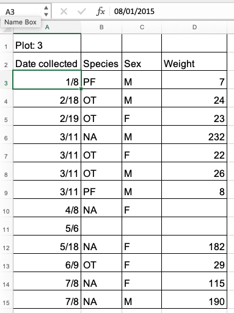
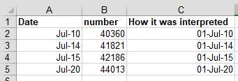
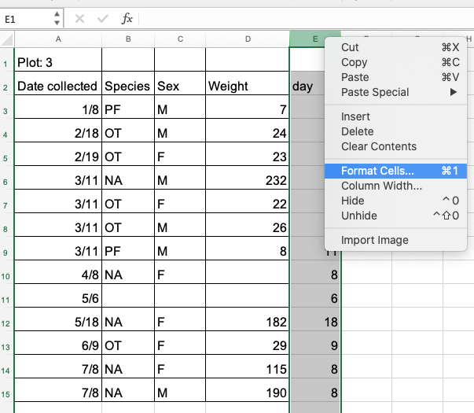
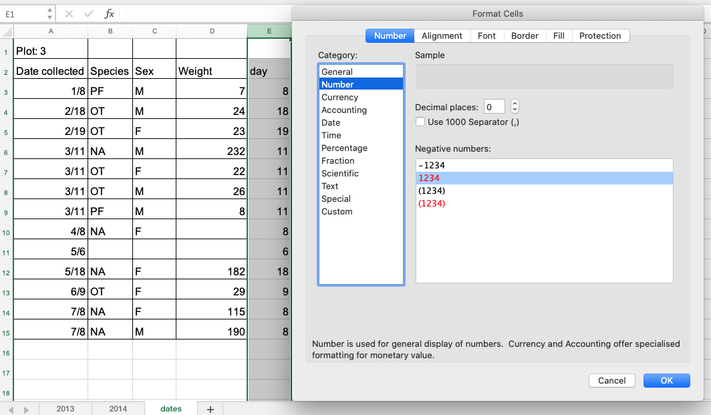

Dates are the scourge of spreadsheets! They are the cause of a huge number of problems with misinterpreted data.

When working with data, the goal is to remove, as much as humanly possible, any ambiguity. But ambiguity can creep into your
dates when there are regional variations (e.g. UK vs. US data formats), or if different software products
(e.g., LibreOffice, Microsoft Excel, Gnumeric) are used. Ambiguity also arises when
spreadsheet programs attempt to "help" you, for example by filling in what it believes is the missing year in the date
you expected to only include a day and a month.

Additionally, Excel can [turn things that are not dates into dates](https://nsaunders.wordpress.com/2012/10/22/gene-name-errors-and-excel-lessons-not-learned/),
for example names or identifiers like MAR1, DEC1, OCT4. Recently, scientists had to
[rename human genes to stop
Microsoft Excel from misreading them as dates](https://www.theverge.com/2020/8/6/21355674/human-genes-rename-microsoft-excel-misreading-dates), as it was estimated that 20% genetics research papers contained errors!

The image below demonstrates some of the many date formatting options available in Excel.

With such a bewildering array of date formats, combined with the fact that many real-world data sets are built up over time by
different people, using different programs, all of whom may be making different assumptions, it becomes difficult
to believe that the dates in any sizeable dataset can be accurate! Fortunately, there is a solution. The best route to unambiguously storing dates is to use separate columns for the day,
month and year. Before we get to this solution, let's first investigate some of the major issues with how dates are
stored in spreadsheets.

## Dates stored as integers

We have seen that Excel displays dates in many different formats, but it stores dates for its own purposes in only one
 format: a number. This number represents how many days have elapsed since 31 December 1899 (the reason for this
 is disconcertingly long-winded and quirky). It means 1 January 1900 is stored as number 1, 2 January 1900
is stored as number 2, and so on. In the example above, 2 July 2014 is stored as
the number 41822.

Storing dates as a number has some advantages: it's easy to add days to a given date using simple arithmetic.
If you had a plan to conduct interviews with every ninety days, you could type:

    =B2+90

And Excel would return:

    30-Sep

In most cases, it retains the format of the cell that is being operated upon. Month and year rollovers are internally
tracked and applied.

However, there is also a significant problem with this system, which is that Excel refuses to believe that dates existed
before 31 December 1899. Open a spreadsheet and add the following to the A1 cell:

     31 December 1899

Now move to a new cell and enter:

    =A1+1

Excel will provide the answer 1 January 1900 (in some format) because the result of this arithmetic returns a date after
31 December 1899. Now try removing a day. Move to another cell and enter:

    =A1-1

Excel returns an error, because it is incapable of understanding that dates existed prior to 31 December 1899. This
is, of course, a huge problem for historians (and many other researchers)!

> ## Note on adding and subtracting dates and times
> Adding months and years to a date is slightly trickier than adding days because we need to make
> sure that we are adding the amount to the correct entity (i.e. month or year). To do so,
>
> - first we need to extract single entities (day, month or year) from the date (how to do that is explained below),
> - then, we can add values to each entity (e.g. month or year),
> - finally, we need to reconstruct the date from the updated day, month, year entities using the `DATE()` function.
>
> Times are handled in a similar way; seconds can be directly
> added, but to add hours and minutes we need to make sure that we are adding
> the quantities to the correct entities. Extracting seconds, minutes and hours from a time is explained
> in one of the exercises below.
{: .callout}

> ## Excel's date systems on Macs
> Excel also entertains a second date system, the 1904 date system, as the default in Excel for Mac.
> This system will assign a
> different serial number than the
> [1900 date system](https://support.microsoft.com/en-us/help/214330/differences-between-the-1900-and-the-1904-date-system-in-excel).
> Because of this,
> [dates must be checked for accuracy when exporting data from Excel](http://datapub.cdlib.org/2014/04/10/abandon-all-hope-ye-who-enter-dates-in-excel/) between Macs and PCs (look for dates that are ~4 years off).
{: .callout}

## Regional date formatting

Different countries write dates differently. If you are in the UK, you will interpret 7/12/88
as the 7th of December 1988. A researcher in the US will interpret the same entry as the
12th of July. This regional variation is handled automatically by your spreadsheet program through a setting in the
 preferences. Errors are easily added to your spreadsheet if your preferences are set incorrectly or, more likely,
 if you share a spreadsheet with a person from a country that uses a different date format. It is especially devastating if
 only some of the date formats are changed, which leaves you with a spreadsheet full of ambiguous dates and no way to repair
 them.

> ## Exercise
>
> Look at the tab 'dates' in the [messy data spreadsheet](../data/messy_survey_data.xls) you used in previous exercises.
> It contains a copy of the 'plot 3' table from the '2014' tab (this is the table that contains the problematic dates).
> You will notice that there are years missing from the "Date collected" column. Just by looking at the entered dates,
> can you figure out the date format that was used?
>
> > ## Solution
> > The date format is 'MM/DD/YYYY' because we have entries like '2/19' and '5/18', which means that the person who
> > entered these dates most probably used the US version of Excel where month comes before day. If we did not have such
> > entries, we would not be able to tell what date was entered! For example, is '7/11' '7th November' or '11th July'?
> {: .solution}
{: .challenge}

## Default year

If no year is specified, the spreadsheet program will assume you mean the current year
and will insert that value. This may be incorrect if you are working with historical data so
be very cautious when working with data that does not have a year specified within its date
variable.

> ## Exercise
>
> Look at the tab 'dates' in the [messy data spreadsheet](../data/messy_survey_data.xls).
> It contains a copy of the 'plot 3' table from the '2014' tab (this is the table that contains the problematic dates).
> Select one of the cells in "Date collected" column, for example cell 'A3'. What is the date Excel thinks is
> entered? What is the year of the date?
>
> > ## Solution
> > Select any cell in "Date collected" column. In the field for the cell formula at the top,
> > Excel will display the value that is stored > > internally for this cell.
> >     
> > From the cell that is selected in the figure above, we can see that Excel has stored the date "08/01/2015"
> > (i.e. 8 January 2015 using the DD/MM/YYYY format).
> > This data was meant to relate to 2014 but Excel has added the year 2015 instead.
> >
> > The cause of this change is that the field assistant who collected the data initially forgot to add their
> > data for 'plot 3' in the dataset. They came back in 2015 to add the missing data into the dataset and entered the
> > dates for 'plot 3' as they had been recorded - without the year. Excel automatically interpreted the year as 2015
> >  the year in which the data was entered into the spreadsheet. This exemplifies how easy it is to introduce errors in dates.
> {: .solution}
{: .challenge}

> ## Exercise
> What happens to the dates in the `dates` tab of the messy spreadsheet if we export this sheet to `.csv`
>(Comma--Separated Value format) and then open the file in a plain text editor (like TextEdit or Notepad)?
> What happens to the dates if we then open the `.csv` file back in Excel?
> > ## Solution
> > 1. Click to the `dates` tab of the [messy data spreadsheet](../data/messy_survey_data.xls).
> > 2. Select `File -> Save As` in Excel and in the drop down menu for file format select `CSV UTF-8 (Comma delimited) (.csv)`
> > (or `Text CSV (.csv)` in LibreOffice).
> > Enter a file name, e.g. `dates-export.csv` and click `Save`.
> > 3. You will see a pop-up that says "This workbook cannot be saved in the selected file
> > format because it contains multiple sheets." Choose `Save Active Sheet` or `OK` depending on your Excel version
> > (In LibreOffice you will see a `Confirm File Format` dialogue: select  `Use Text CSV format`. You will then be presented
> > with a `Export Text File` dialogue: select `OK`. You will then be presented with a `Warning` dialogue: select `OK`.)
> > 4. Close your current messy data spreadsheet (you can reopen it later).
> > 5. Open the `dates-export.csv` file (or whatever you named it). Right click and select `Open With`.
> > Choose a plain text editor (like TextEdit or Notepad) and view the file. Notice that the dates display as month/day
> > without any year information.
> > 6. Now right click on the file again and open with Excel (or LibreOffice). In Excel, notice that the dates display
> > with the current year, not 2015 as previously assumed by Excel. In LibreOffice, no year is added, but the date is no
> > longer treated as a date.
> > As you can see, exporting data from a spreadsheet program and then importing it back again can fundamentally change the data!
> {: .solution}
{: .challenge}

> ## Note on exporting
Some versions of Excel, when exporting into a text-based format (such as CSV), will export its internal date integer
representation of the date instead of the date's value. This can potentially lead to problems if you use other software
to manipulate the data as they may not understand Excel's date encodings.
{: .callout}

## Historical data
As far as Excel is concerned, time began on 31 December 1899 and any date before this time is not real. If you are
mixing historic data from before and after this date, Excel will translate only the post-1900 dates into its internal
format, resulting in mixed data. If you are working with historic data, be extremely careful with your dates!

## Preferred date formats

Entering a date in a single cell is quick and easy, but it is open to so many potential problems that a new solution
is needed if we are to remove ambiguity from spreadsheet dates. That solution is to separate dates into their component
parts. Let's have a look at some good options for storing dates.

### Storing dates as YEAR, MONTH, DAY
As previously mentioned, storing dates in YEAR, MONTH, DAY format is one good alternative for storing dates
and reduces the risk of ambiguity.

For instance, the following is a spreadsheet that represents insect counts that were taken every few days over the summer:

According to Excel, this person had been collecting bugs over a number of year, including some dates in the future!

> ## Exercise
>
> Challenge: pulling month, day and year out of dates.
>
> 1. Look at the tab 'dates' in our messy data spreadsheet. Extract month, day and year from the dates in the
> "Date collected" column into three new columns called
> 'month', 'day', 'year'. To do so, you can
> use the following built-in Excel functions:
>
>     `YEAR()`
>     `MONTH()`
>     `DAY()`
> 2. Apply the formulas on each of the row of table 'plot 3' in the 'dates' tab. To do so, drag the formula for the
> first row down to the last row.
> 3. Make sure the new columns are formatted as a number and not as a date.
>
> > ## Solution
> > 1. Create column 'day' for the first row of the table (note that this is not
> > the first row of the spreadsheet) and insert formula `=DAY(A3)` in cell E3.
> > This applies the function `DAY()` on the value in cell A3, which is the date
> > of the first observation.
> > 2. Drag this formula to the last row of the table -
> > you will see the formulas and calculations for the month appearing in the cells below.
> >   
> > 3. To format the
> > column 'day' as a whole number, right click on the column 'E' (for 'day') and select `Format cells...` option.
> >   
> > Select 'Number' and set decimal places to 0.
> >   
> > Repeat the process for month and year. You should end up with a table like the one below.
> >   
> > Again, as in the previous exercise but this time using the `YEAR()` function,
> > we can see that Excel saved the year for data as 2015 (the year the data is entered) instead of 2014 (the
> > year the data was collected). This was entirely the mistake of the field assistant but by being helpful
> > Excel managed to "mask" this error.
> {: .solution}
{: .challenge}

As for dates, times are handled in a similar way and there are functions to extract hours, minutes and seconds.

> ## (Optional) Exercise
>
> Challenge: pulling hour, minute and second out of the current time.
>
> Current time and date are best retrieved using the functions `NOW()`, which
> returns the current date and time, and `TODAY()`, which returns the current
> date. The results will be formatted according to your computer's settings.
>
> 1. Extract the year, month and day from the current date and time string
> returned by the `NOW()` function.
> 2. Calculate the current time using `NOW()-TODAY()`.
> 3. Extract the hour, minute and second from the current time using
> functions `HOUR()`, `MINUTE()` and `SECOND()`.
>
> > ## Solution
> > 1. To get the year, type `=YEAR(NOW())` into any cell in your spreadsheet. To get the month, type `=MONTH(NOW())`. To get the day, type `=DAY(NOW())`.
> > 2. Typing `=NOW()-TODAY()` will result in a decimal value that is not easily human parsable to a clock-based time.
> > You will need to use the strategies in the third part of this challenge to convert this decimal value to
> > readable time.
> > 3. To extract the hour, type `=HOUR(NOW()-TODAY())` and similarly for minute and second.
> {: .solution}
{: .challenge}

###  Storing dates as YEAR, DAY-OF-YEAR

Storing dates as year and day-of-year (DOY) is an alternative method of storing dates with little ambiguity. Statistical
models often incorporate year as a factor, or a categorical variable, rather than a numeric variable,
to account for year-to-year variation, and DOY can be used to measure the passage of time within a year.

To convert all your dates into DOY format, here is a useful guide:

###  Storing dates as a single string

Another alternative is to convert the date string into a single string using the `YYYYMMDDhhmmss` format.
For example the date `March 24, 2015 17:25:35` would become `20150324172535`, where:

* YYYY:   the full year, i.e. 2015
* MM:     the month, i.e. 03
* DD:     the day of month, i.e. 24
* hh:     hour of day, i.e. 17
* mm:     minutes, i.e. 25
* ss:     seconds, i.e. 35

Such strings will be correctly sorted in ascending or descending order and can be correctly parsed by the receiving data
analysis software. Make sure your column containing such data is formatted as 'text'.
