When you have a well-structured data table, you can use several simple
techniques within your spreadsheet to ensure the data you enter is
free of errors. These approaches include techniques that are
implemented prior to entering data (quality assurance) and
techniques that are used after entering data to check for errors
(quality control). These techniques can make data entry easier as well as more robust.

## Validating data on input

When we input data into a cell of a spreadsheet we are typically not constrained in the type of data we enter.
In any one column, the spreadsheets software will not warn us if we start to enter a mix of text, numbers or dates
in different rows.
Even if we are not facing constraints from the software, as a researcher we often anticipate that all data in one
column will be of a certain type (it should be).
It is also possible that the nature of the data contained in the table allows us to place additional restrictions on
the acceptable values for cells in a column.
For example a column recording age in years should be numeric, greater than 0 and is unlikely to be greater than 120.

We will be working with a couple of examples of data validation
rules but many others exist. For an overview of data validation rules
available in Excel, check out the [Excel support page on data validation](https://support.office.com/en-us/article/Apply-data-validation-to-cells-29FECBCC-D1B9-42C1-9D76-EFF3CE5F7249). General steps to employ data validation are as follows.

1. Open the tab 'semi-cleaned-combined' of the
[messy data spreadsheet](../data/messy_survey_data.xls).
It contains tables from the messy data tabs '2013' and '2014' combined into a single table (you may note that data is
not fully yet cleaned, although it is in a much better shape than it was in the tabs '2013' and '2014').

2. Select the column 'plot_id'.

3. On the `Data` tab from the top level menu select `Data Validation`, or `Data Tools` and then `Data Validation`
or `Validation Tools` (depending on your version of Excel) or `Validity` in LibreOffice.

    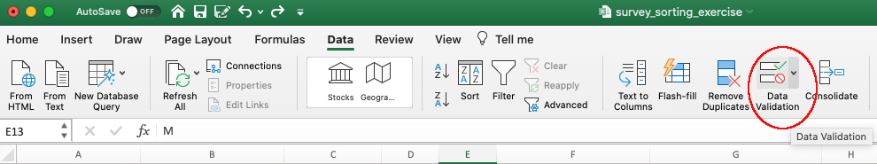

4. In the `Allow` box of tab `Settings` select 'Whole numbers' of data that should be in the
   column. Other options include decimals, lists of items, dates, and
   other values.

    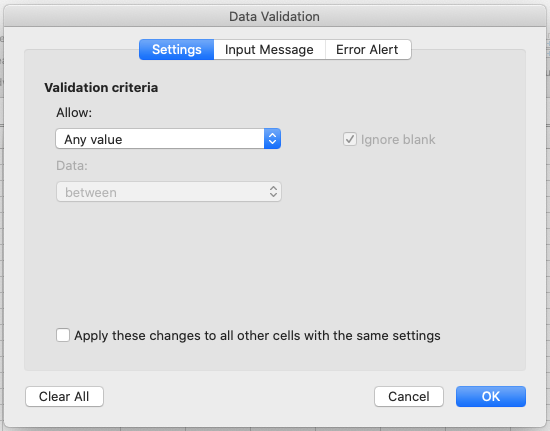

5. Now attempt to enter text into a cell in the 'plot_id' column. You should be prevented from doing so, as the column
is now locked down to whole numbers only.

Excel allows us to specify a variety of data validations to be applied to cell contents.
If the validation fails, an error is raised and the data we attempted to enter is rejected.
In addition to providing validation when we enter data, Excel allows us to add validations to data that has
already been entered. Note, however, that the validation is not applied retrospectively, so that incorrect data are not removed.
Instead, if a particular cell with a value entered previously fails the validation check - depending on the Excel version -
a triangle may be placed in the top left corner of
the cell as a warning, or you may not get any warning at all (but you may be able to request invalid cells to be
circled from the `Data validation` drop-down button).
For this reason, it is best practice to set up validations before you start entering data.

### Restricting data to a numeric range

Now let's try this out by setting the 'plot_id' in our spreadsheet to only allow
plot values that are integers between 1 and 24.

> ## Exercise
> Set the 'plot_id' column in tab ‘semi-cleaned-combined’ of the [messy data spreadsheet](../data/messy_survey_data.xls)
> to only allow values that are integers between 1 and 24.
> > ## Solution
> > 1. Open the tab 'semi-cleaned-combined' of [messy data spreadsheet](../data/messy_survey_data.xls) and select the 'plot_id' column.
> > 2. On the `Data` tab the top level menu select `Data Validation`, or `Data Tools` and then `Data Validation`
> > or `Validation Tools` (depending on your version of Excel) or `Validity` in LibreOffice.
> > 3. In the `Allow` box of the `Settings` tab select `Whole number` (and in LibreOffice select the `Data` field to be
> > `valid range`.
> > 4. Set the minimum and maximum values to 1 and 24.
    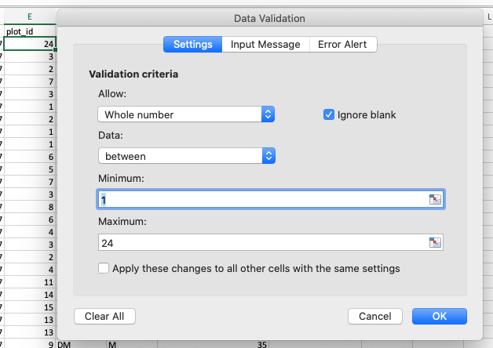
> > Now let's try entering a new value in the plot column that is not a valid
> > plot id. The spreadsheet stops us from entering the wrong value and asks us if we
> > would like to try again.
    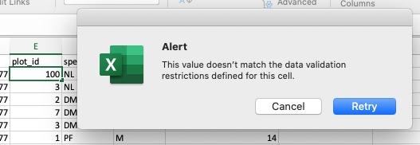
> > You can also customise the resulting message to be more informative by entering
> > your own message in the `Input Message` tab (or, in LibreOffice, by selecting the `Error alert` tab and entering a
> > message in the `Error message` field).
    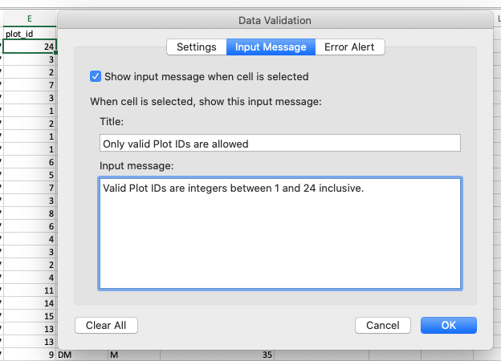
> > You can also set the invalid data to result in a warning rather than an error by modifying the `Style`
option on the `Error Alert` tab (or the `Action` field in LibreOffice).
> > 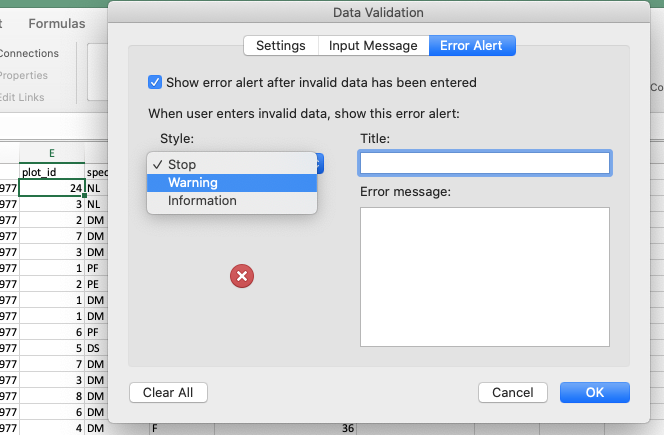
> > 5. In newer versions of Excel, you may also have an option to indicate all previous invalid entries once you have
> > entered your restricted values.
> >    
> > You have now provided a restriction that will be validated each time you try and
> > enter data into the selected cells. If you type a value which is not on the list you will get an error message.
> > This not only prevents data input errors, but also makes it easier and faster to enter data.
> {: .solution}
{: .challenge}

### Restricting data to entries from a list

If you use a list of options to restrict data entry, the spreadsheet
will provide you with a drop-down list of the available items. Think about trying to
remember how to spell "Dipodomys spectabilis" for species each time you need to enter that value,
or whether or not you capitalised the words correctly. By restricting values in cells to a predefined list of
values, you can select the right option from the list every time. Let’s apply this to our data.

> ## Exercise
> Restrict the values of the 'species_id' column in tab ‘semi-cleaned-combined’ of the [messy data spreadsheet](../data/messy_survey_data.xls)
> to allow only values from the following list: “DM, NL, DS, PP, PE, PF”.
>
> > ## Solution
> > 1. Open the tab 'semi-cleaned-combined' of `messy_survey_data.xls` and select the 'species_id' column.
> > 2. On the `Data` tab the top level menu select `Data Validation`, or `Data Tools` and then `Data Validation`
> > or `Validation Tools` (depending on your version of Excel) or `Validity` in LibreOffice.
> > 3. In the `Allow` box of the `Settings` tab select `List`.
> > 4. Type a list of all the values that you want to be accepted in this column, separated by a comma (with no spaces).
> > For example, type "DM,NL,DS,PP,PE,PF" (in LibreOffice, skip the commas and add each entry to a new line). Note this is only a small subset of allowed species ids - [the whole
> > set](https://ndownloader.figshare.com/files/3299483) is much larger but for the purposes of this exercise we want to show you how to restrict a cell to a list of
> > values and what happens when old data does not conform to this restriction.
> >    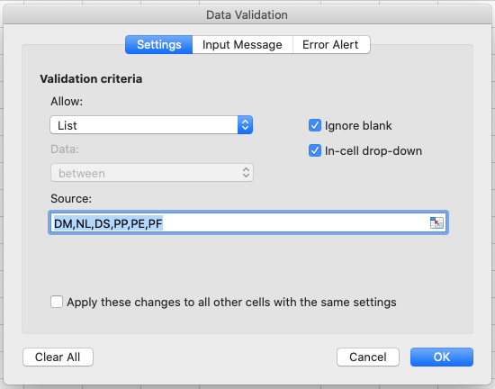
> > 5. Create a meaningful input message and modify alert error type, as in the previous exercise, then click OK.
> > 6. Scroll to the bottom of your data and select a cell in the `species_id` column in a new row.
> > When a cell in this column is selected, a drop-down arrow will appear.
> > When you click the arrow you will be able to select a value from your list of allowed values.
> > 7. In newer versions of Excel, you may also have an option to indicate all previous invalid entries once you have
> > entered your restricted values.
> >    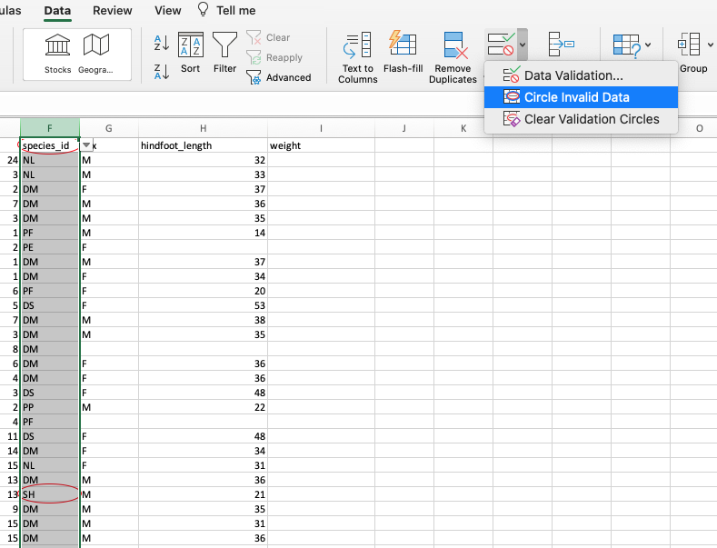
> > You have now provided a restriction that will be validated each time you try and
> > enter data into the selected cells. If you type a value which is not on the list you will get an error message.
> > This not only prevents data input errors, but also makes it easier and faster to enter data.
> {: .solution}
{: .challenge}

Typing a list of values where only a few possible values exist might be convenient, but if the list is longer (e.g.
all allowed species) it
makes sense to create it as a small table (in a separate tab of the workbook).
We can give the table a name and then reference the table name as the source of acceptable inputs when the source box
appears in the `Data Validation` pop-out. For example, the table of all species can be copied from the
[file `species.csv`](https://ndownloader.figshare.com/files/3299483) and then referenced
in your spreadsheet to provide the list of all valid species names and their abbreviations (ids).
Using a table in this way makes the data entry process more flexible.
If you add or remove contents from the table, then these are immediately reflected in any new cell entries based on this source.
You can also have different cells refer to the same table of acceptable inputs.

## Quality control - identifying outliers

> ## Tip: keep your raw data - raw
> Before doing any quality control operations, save your original file with the formulas and a name indicating it is the original
data. Create a separate file with a new name, and ensure your data is stored as values and not as formulas.
Because formulas refer to other cells, and you may be moving cells around, you may compromise the integrity of your data if you do not
take this step!
{: .callout}

> ## Tip: keep track of your modifications
> As you start manipulating your data files, create a `README.txt` text file to keep track of your files and
document your manipulations so that they may be easily understood and replicated, either by your future self or by an independent
researcher. Your `README.txt` file should document all of the files in your data set (including documentation), describe their content and
format, and lay out the organising principles of folders and subfolders. For each of the separate files listed, it is a good idea to
document the manipulations or analyses that were carried out on those data.
[Cornell University's Research Data Management Service Group](https://data.research.cornell.edu/content/readme) provides detailed
guidelines for how to write a good README file, along with an adaptable template.
{: .callout}

### Sorting data
Bad values often sort to the bottom or top of the column. For example, if your data should be numeric, then alphabetical and null data
will group at the ends of the sorted data. Sort your data by each field, one at a time. Scan through each column, but pay the most
attention to the top and the bottom of a column.
If your dataset is well-structured and does not contain formulas, sorting should never affect the integrity of your dataset.

> ## Tip: expand the sort
> Remember to expand your sort in order to prevent data corruption. Expanding your sort ensures that the all the data
> in one row move together instead of only sorting a single column in isolation. Sorting by only a single column will
> scramble your data - a single row will no longer represent an individual observation.
{: .callout}

> ## Exercise
>
> Look at the 'semi-cleaned-combined' tab of the [messy data spreadsheet](../data/messy_survey_data.xls). It contains
> tables from the messy data tabs '2013' and '2014' combined into a single table in a single tab (you will note that
> the data is not yet fully cleaned).
>
> Sort the `weight_grams` column in your spreadsheet program from `Largest to Smallest`.
> What do you notice?
>
> > ## Solution
> >
1. Select `weight_grams` column.
2. Click the `Sort` button on the Data tab from the top level menu in Excel (in LibreOffice select the `Data` menu and
 then select `Sort`.
    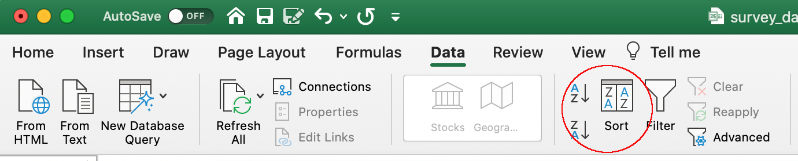
    Note that in older versions of Excel you may get just the `Sort` button without the drop-down menu, followed
    by a pop up window to specify the column you want to sort and the sort order (shown in figure below).
    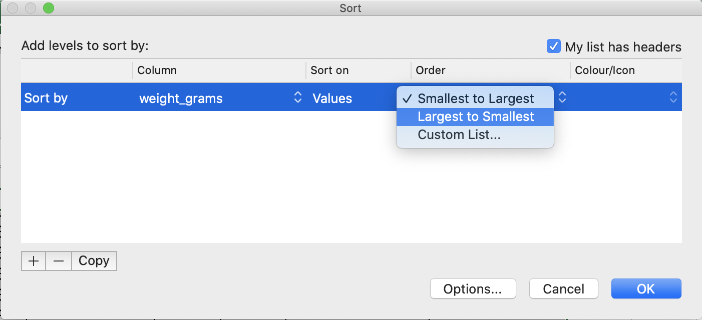
3. In the pop-up that appears make sure you select `Expand the selection` to make sure data in other columns is
    moved together with the data in the column you are sorting.
    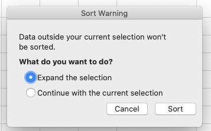
4. Note how the odd values sort to the top and bottom of the data.
    The cells containing no data values sort to the bottom of the tabular data, while the cells where the letter
    "g" was included can be found towards the top or bottom. This is a powerful way to check your data for outliers and odd values.
    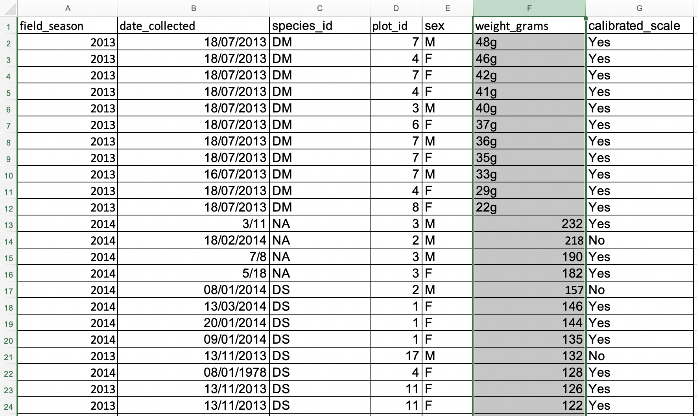
> {: .solution}
{: .challenge}

### Conditional formatting
Conditional formatting allows you to format data based on some criteria, e.g. you can colour code your values by some
criteria from lowest to highest. This can also make it easier to scan your data for outliers.
Conditional formatting should be used with caution, but it can be a great way to flag inconsistent values or errors when
entering data. Let's apply some to our data.

> ## Exercise
>  Look at the 'semi-cleaned-combined' tab of the
> [messy data spreadsheet](../data/messy_survey_data.xls) and apply
> any `2-Color Scale` formatting rule to column `weight_grams`.
>
> > ## Solution
1. Select `weight_grams` column.
2. In the main Excel menu bar, click `Home` > `Conditional Formatting...` choose `New rule` (in LibreOffice from the
 `Format` menu, select `Conditional` and then `Color scale`).
    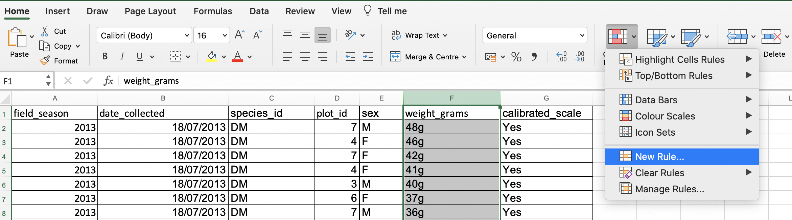
3. In the `New Formatting Rule` window, apply any `2-Color Scale` formatting rule. (In LibreOffice select `Color scale
 (2 entries)` from the top-middle drop-down list and click `OK`.
    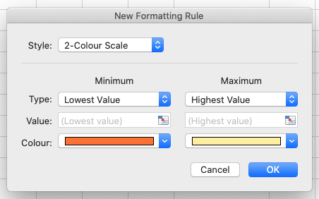
4. Now we can scan through the column and different colours will stand out. Do you notice any strange values?
5. Cells that contain non-numerical values are not coloured making them easier to spot.
   This includes both the cells where the letter "g" was
   included and the empty cells. They show up at either at the top or at the bottom of the data but may not be as easy to
   spot if you have a very large dataset and have to scroll a lot.
       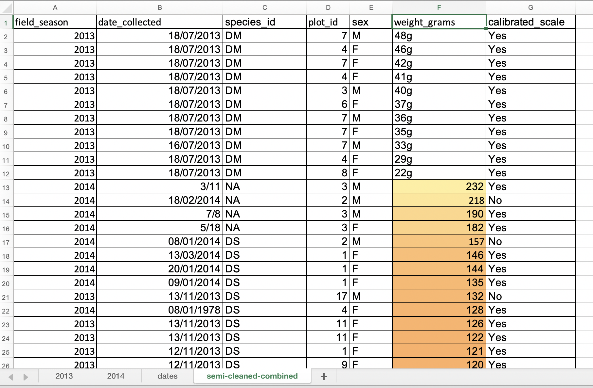
> {: .solution}
{: .challenge}

> ## Scanning for outliers
> It is nice to be able to do these scans for outliers in spreadsheets (such as using sorting or conditional formatting),
but we can also do these
checks in a programming languages like R, Python and SQL, or using OpenRefine - which may be even more suitable if you have
larger datasets with, e.g., with 10K+ or 100K+ rows which are difficult to scroll down to the bottom of to spot outliers.
{: .testimonial}
