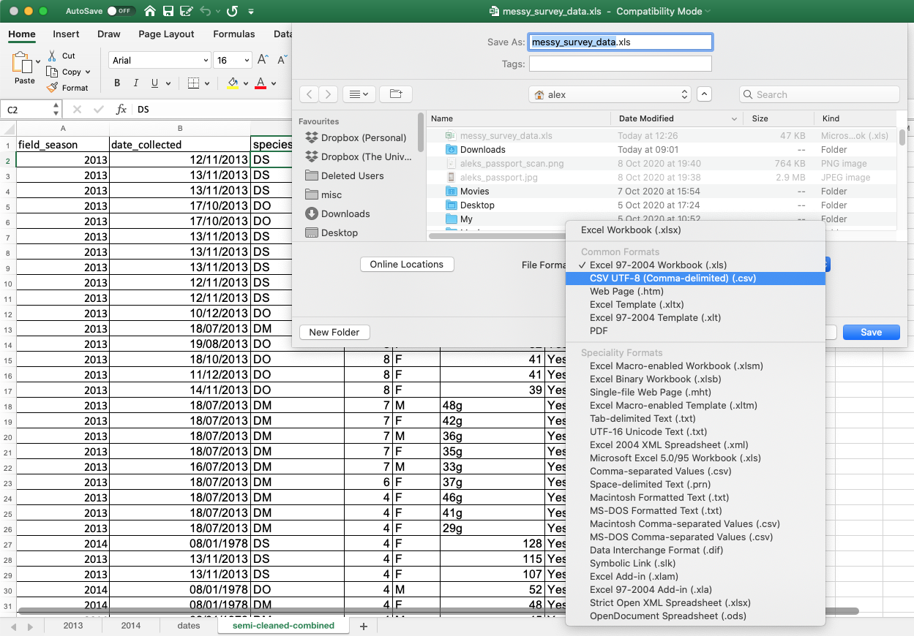
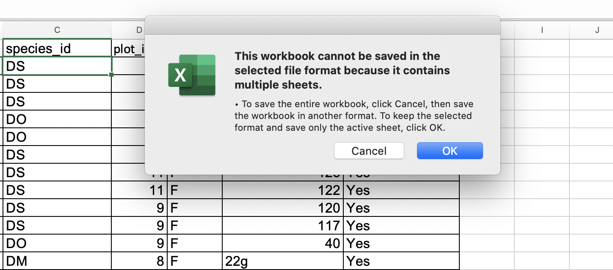

Storing the data you are going to work with for your analyses in Excel
default file format (`*.xls` or `*.xlsx` - depending on the Excel
version) is not a good idea. Here are some reasons why:

- Excel's `*.xls` or `*.xlsx` are proprietary file formats, and it is possible that in
  the future technology will not exist (or will become sufficiently
  rare) to make it inconvenient, if not impossible, to open the file. For example, `*.xls` is already an older file
  format than `*.xlxs` and it is possible that Microsoft may retire it in the future.
- Other spreadsheet software may not be able to open files
  saved in a proprietary Excel format.
- Different versions of Excel may handle data
  differently, leading to inconsistencies.
- Journals and grant agencies are increasingly requiring you
  to deposit your data in a data repository, and most of them do not
  accept Excel format (because of the reasons listed above). Instead, these data repositories require files to be
   deposited in one of the formats discussed below.

The above points also apply to other formats such as open data formats used by LibreOffice and Open Office. These
formats are not static and do not get parsed the same way by different software packages.

As an example of inconsistencies in data storage, remember how we investigated how Excel stores dates.
There are multiple defaults for different versions of the software, and you can switch between them all. So, say you are
compiling Excel-stored data from multiple sources. There are dates in each file - Excel interprets them as their own internally consistent
 numbers. When you combine the data, Excel will take the serial number from the place you are importing it, and interpret it
using the rule set for the version of Excel you are using. These rules may not align. Essentially, you could be adding
errors to your data, and it would not necessarily be flagged by any data cleaning methods.

Storing data in a universal, open, and static format will help deal with this problem, e.g. formats such as tab-delimited (tab separated values
or TSV) or comma-delimited (comma separated values or CSV). CSV files are plain text files where the columns are separated by commas,
hence 'comma separated values' or CSV. The advantage of a CSV file over an Excel or other proprietary formats is that we
 can open and read a CSV file using just about any software, including plain text editors like TextEdit or NotePad. Hence
 these files are more robust and more likely to be accessible in the future.

Data in a CSV file can also be easily imported into other formats and environments, such as SQLite and R. We are not
tied to a specific version of a specific (potentially expensive) program when we work with CSV files, so
it is a good format to work with for maximum portability and endurance. Most spreadsheet programs can save to delimited
text formats, although they may give you a warning during the file export.

To save a file you have opened in Excel in CSV format:

1. From the top menu select `File` then `Save as`.
2. You will be presented with different options for exporting to CSV file format, depending on your Excel version.
3. In the 'Format' field, from the list select `CSV UTF-8 (Comma-delimited)(*.csv)` (or `Text CSV (.csv)` in LibreOffice).
    
4. Double check the file name and the location where you want to save it and hit 'Save'.
5. If you are saving an Excel file with multiple tabs, Excel will save only the currently active sheet (there is no
option for multiple tabs in CSV) and warn you that you cannot save multiple sheets to a CSV file at the same time. If
you need to save multiple tabs, you must save each one as its own CSV file.

    

> ## Note on backwards compatibility
You can open CSV files in Excel (or LibreOffice)!
{: .callout}

> ## A note on Python/R and Excel's `.xls`/`.xlxs` formats
>
> There are Python and R packages that can read `.xls`/`.xlxs` files.
> It is even possible to access different
> worksheets in the Excel spreadsheet documents. However, because these
> packages parse data tables from proprietary and non-static
> software, there is no guarantee that they will continue to
> work on new versions of Excel. Exporting your data to CSV or TSV
> format is much safer and more reproducible.
{: .callout}

> ## Note: when data contains commas
>
> In some datasets, the data values themselves may include commas (,). In that
> case, you need to make sure that the commas are properly escaped when saving
> the file. Otherwise, the software that you use (including Excel) will most
> likely incorrectly display the data in columns. This is because the commas
> which are a part of the data values will be interpreted as delimiters.
>
> If you are working with data that contains commas, the fields should be
> enclosed with double quotes. This should occur automatically when you export from a spreadsheet program.
> However, it is always a good idea to double check your CSV after it is saved by opening it in a spreadsheet program
> and reviewing the columns to ensure that no new ones have been added. For more of a discussion on data formats and
> potential issues with commas within datasets see [the discussion page](/discuss).
{: .callout}
