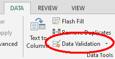
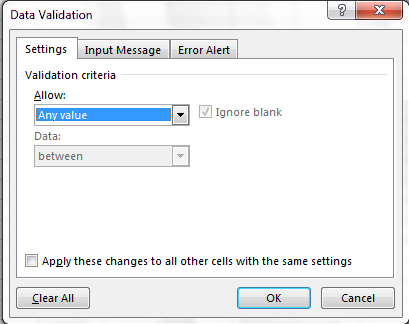
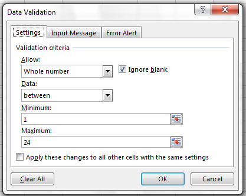
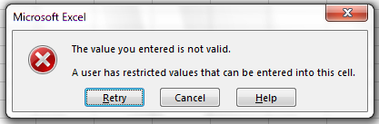
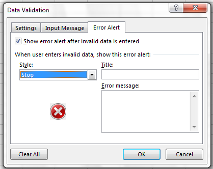

Authors:**Christie Bahlai**, **Aleksandra Pawlik** 
Contributors: **Jennifer Bryan**, **Alexander Duryee**, **Jeffrey Hollister**, **Daisie Huang**, **Owen Jones**,
**Ben Marwick**, and **Ethan White**

When you have a well-structured data table, you can use several simple
techniques within your spreadsheet to ensure the data you enter is
free of errors. These approaches include techniques that are
implemented prior to entering data (quality assurance) and
techniques that are used after entering data to check for errors
(quality control).

# Quality Assurance

Quality assurance stops bad data from ever being entered by checking to see if
values are valid during data entry. For example, if research is being conducted
at sites A, B, and C, then the value V (which is right next to B on the
keyboard) should never be entered. Likewise if one of the kinds of data being
collected is a count, only integers greater than or equal to zero should be
allowed.

To control the kind of data entered into a a spreadsheet we use Data Validation
(Excel) or Validity (Libre Office Calc), to set the values that can be entered
in each data column.

1\. Select the cells or column you want to validate

2\. On the `Data` tab select `Data Validation`

3\. In the `Allow` box select the kind of data that should be in the
   column. Options include whole numbers, decimals, lists of items, dates, and
   other values.

   
4\. After selecting an item enter any additional details. For example, if you've
   chosen a list of values, enter a comma-delimited list of allowable
   values in the `Source` box.

Let's try this out by setting the plot column in our spreadsheet to only allow
plot values that are integers between 1 and 24.

1. Select the `plot_id` column
2. On the `Data` tab select `Data Validation`
3. In the `Allow` box select `Whole number`
4. Set the minimum and maximum values to 1 and 24.

Now let's try entering a new value in the plot column that isn't a valid
plot. The spreadsheet stops us from entering the wrong value and asks us if we
would like to try again.

You can also customize the resulting message to be more informative by entering
your own message in the `Input Message` tab

or allow invalid data to result in a warning rather than an error by modifying the `Style`
option on the `Error Alert` tab.

Quality assurance can make data entry easier as well as more robust. For
example, if you use a list of options to restrict data entry, the spreadsheet
will provide you with a drop-downlist of the available items. So, instead of
trying to remember how to spell *Dipodomys spectabilis*, you can select the
right option from the list.

# Quality Control

Tip: *Before doing any quality control operations, save your original file with the formulas and a name indicating it is the original
data. Create a separate file with appropriate naming and versioning, and ensure your data is stored as values and not as formulas. 
Because formulas refer to other cells, and you may be moving cells around, you may compromise the integrity of your data if you do not
take this step!*

readMe (README) files: As you start manipulating your data files, create a readMe document / text file to keep track of your files and
document your manipulations so that they may be easily understood and replicated, either by your future self or by an independent
researcher. Your readMe file should document all of the files in your data set (including documentation), describe their content and
format, and lay out the organizing principles of folders and subfolders. For each of the separate files listed, it is a good idea to
document the manipulations or analyses that were carried out on those data.

<!-- [Example: converting all data to values: use soybean aphid suction trap dataset for this section] -->

## Sorting
Bad values often sort to the bottom or top of the column. For example, if your data should be numeric, then alphabetical and null data
will group at the ends of the sorted data. Sort your data by each field, one at a time. Scan through each column, but pay the most
attention to the top and the bottom of a column. 
If your dataset is well-structured and does not contain formulas, sorting should never affect the integrity of your dataset.

 Remember to expand your sort in order to prevent data corruption. Expanding your sort ensures that 
> the the all the data in one row move together instead of only sorting a single column in isolation as shown in the screenshot.

Let's try do the following sorting challange:

> Challenge: 
>
> Download the survey_data_messy_quality_control.xlsx file for this sort exersize.
>
> Once downloaded, sort the weight_grams column in your spreadsheet program from Smallets to Largest. 
>
> What do you notice?
>
> > ## Solution
> > 

> >
> > Note how the outliers in the case of the 2013 data sort to the bottom of the tabular data. 
> > The cells containing no data values as well as the cells where the letter "g" was included can be 
> > found towards the bottom of the tabular data.
> > 

> >
> {: .solution}
>
{: .challenge}

## Conditional formatting ##
Conditional formatting basically can do something like color code your values by some
criteria or lowest to highest. This makes it easy to scan your data for outliers.

Conditional formatting should be used with caution, but it can be a great way to flag inconsistent values when entering data.

Let's try this again with weight. Go to Format then Conditional Formatting.

We'll do the *2-Color Scale* with Lowest to Highest for the orange colors. Then we'll 
apply that to the *wgt* column again. Now we can scan through and different colors will
stand out. Again, do we notice any strange values?

It is nice to do be able to do these scans in spreadsheets, but we also can do these
checks in a programming language like R, or in OpenRefine or SQL. 
